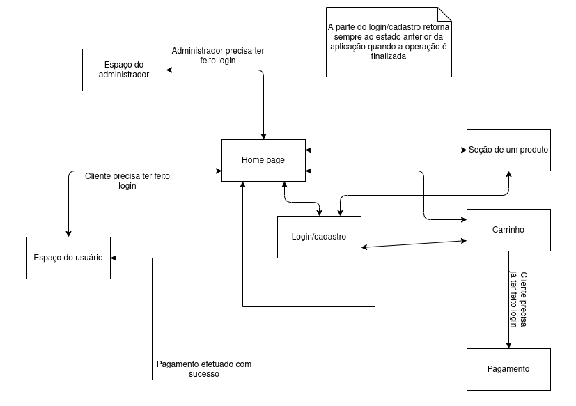

# Trabalho Desenvolvimento Web

Repositório contendo os arquivos desenvolvidos para o trabalho de desenvolvimento web. Grupo com Cesar Guibo e Fabio Destro.

## [https://mundo-das-letras.herokuapp.com/](https://mundo-das-letras.herokuapp.com/)

## Desenvolvido por:

- Fabio Fogarin Destro, 10284667
- Leonardo Fonseca, 11219241
- Cesar Henrique de Araujo Guibo, 11218705

# Requisitos

## Tipos de usuarios

O sistema possui 2 tipos de usuarios: Clientes e Administradores.

- Administradores são responsáveis por registrar/gerenciar administradores, clientes e livros (produto principal do sistema). A aplicação já deve contar com um administrador padrão com usuário 'admin' e senha 'admin'.
- Clientes são pessoas que acessam o sistema para comprar livros.

## Entidades do sistema

O sistema conta com 4 principais entidades: administradores, clientes, livros, categorias

- O registro de administradores deve conter: id, nome, telefone e email, senha
- O registro de clientes deve conter: id, nome, endereço, telefone e email, senha.
- O registro de livros deve conter: id, título, foto, descrição, preço, quantidade em estoque, quantidade vendida, autor, categoria, dados de pré-visualização.
- O registro de categorias deve conter: id, nome

## Funcionalidade de compras

Os livros registrados no sistema podem ser comprados pelos clientes.

- Um cliente cadastrado pode adicionar livros em seu carrinho de compras.
- A quantidade de cada livro no carrinho de compras pode ser alterada pelo usuário.
- Um livro no carrinho de compras pode ser removido pelo usuário.
- As compras são efetuadas com cartão de créditos (por enquanto, qualquer número é aceito pelo sistema).
- Ao efetuar uma compra com sucesso, a quantidade em estoque dos produtos comprados deve ser atualizada.

## Gerenciamento de livros

Os administradores devem ter a capacidade de gerenciar os livros vendidos no e-commerce, sendo capaz de efetuar as seguintes ações:

- Adicionar novos livros
- Editar livros cadastrados (exemplo: editar a quantidade em estoque)
- Ler as informações de um livros cadastrados
- Apagar livros cadastrados

## Pré-visualização de livros vendidos

Um usuário deve ser capaz de visualizar uma página com as informações de cada livro cadastrado no sistema.

Como diferencial, no e-commerce, será possível fazer a pré-visualização de uma parte inicial do livro vendido gratuitamente.

## Interface

A interface do sistema deve buscar oferecer uma boa usabilidade, implementando requisitos de acessibilidade e adaptação a dispositivos móveis (responsividade).

# Descrição do Projeto

O projeto **Livraria Mundo das Letras** tem como intuito ser um e-commerce focado em livros físicos. A livraria digital tem como principal diferencial a pré-visualização gratuita dos livros vendidos.

No site, cada livro tem uma categoria, permitindo que o usuário filtre de acordo com a sua preferência. O site permite dois tipos de login, como cliente ou administrador, ambos fornecendo ID, nome, telefone, email e senha, com a adição de endereço para o cliente.

Na página inicial o usuário poderá escolher o livro olhando livremente ou usando o filtro de categoria, tendo acesso ao título, autor, capa e preço. Clicando no livro, ele pode ver a página específica do mesmo, onde, além das informações que ele já tinha na página inicial, o usuário pode ver uma descrição do livro, o número de cópias vendidas e em estoque, além de poder comprar ou abrir um preview do livro.

A preview só está disponível após o clique e contém algumas das páginas iniciais do livro, permitindo que o usuário leia-as e decida se quer ou não comprá-lo.

O usuário pode visitar seu carrinho, onde ele pode confirmar a compra, editar a quantidade de itens ou remover um livro da lista. Ainda é possível que ele logue ou crie uma conta, que pode ser de cliente ou de administrador. A de cliente funciona da mesma forma de qualquer conta de site de vendas online, ou seja, ele deve ter uma conta para comprar um produto, com as informações básicas. Na conta de administrador, o dono pode editar dados já cadastrados, cadastrar novos produtos ou administradores, por meio de um formulário, que aparece após o clique no botão “adicionar” referente à tabela ou até apagar livros.

## Diagrama de navegação

# Comentários sobre o código

A aplicação front-end foi desenvolvida utilizando a tecnologia [React.js](https://pt-br.reactjs.org/) e o código está sub-divido em páginas e componentes, buscando separar as funcionalidades e utilizar os conceitos de componentes para obter um código de fácil manutenção e reusabilidade.

A aplicação back-end foi desenvolvida utilizando Node.js e Express. Foi desenvolvida uma API que recebe e responde requisições do cliente front-end. O aplicação back-end também conta com um banco de dados não relacional MongoDB.

# Plano pra teste

Os testes foram executados de forma manual a partir de um navegador, em que todos os fluxos de páginas e ações foram executados verificando se o resultado esperado era obtido.

# Resultado dos testes

Utilizando os testes manuais descritos no plano de testes, foi possivel observar que a aplicação está funcionando adequadamente uma vez que exibe as telas corretas e reage corretamente as ações efetuas.

# Procedimentos de instalação

Para instalar o sistema e ser capaz de executa-lo em seu computador, primeiramente é necessário instalar o [Node.js](https://nodejs.org/) e o NPM (que vem junto com a instalação do Node). Pode-se utilizar também o gestor de pacotes Yarn, em vez do NPM.

Na pasta principal do projeto, basta utilizar o comando `yarn buid` caso deseje atualizar a versão do cliente que será exibida pelo servidor. Em sequência rode o comando `yarn start` para instalar as dependencias necessárias e iniciar o servidor.

IMPORTANTE: Para o correto funcionamento do servidor, é necessário adicionar um arquivo `.env` na pasta do servidor, com variavies de ambiente, que não estão expostas no GitHub já que contém dados sensiveis. O arquivo será disponibilizado pelo grupo aos revisores caso necessário. Um alternativa é a versão online do sistema, que pode ser acessada em: [https://mundo-das-letras.herokuapp.com/](https://mundo-das-letras.herokuapp.com/).

Outra opção é executar em paralelo o servidor e o cliente, tendo assim mais controle sobre mudanças efetuadas. Está opção é mais indicada caso tenho o interesse em efetuar mudanças e observar seus efeitos imediatamente.

Para fazer isso, dentro da pasta do cliente ou servidor, rode o comando `npm install` ou `yarn` para instalar as dependencias do projeto e em sequencia, o comando `npm start` ou `yarn start` para executa-lo.

Isso deve ser feito nas duas pastas, um terminal deve rodar o servidor e outro o site. Além disso, para o login na correção, foi criada uma conta no site.

# Login de acesso

Login: correcao@nota.10

Senha: nota10

A conta foi feita administradora para possibilidade de testes de operações com livros e usuários.

# Problemas

Como estamos armazenando imagems no banco de dados, o retorno é lento e, por isso, os livros da página inicial e as páginas de livros específicos demoram um pouco para carregar. Além disso, o filtro por categorias demora para ser aplicado.

# Comentários
